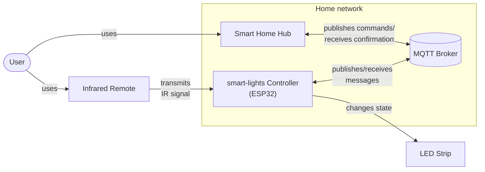

# Architecture Overview

This document provides a high-level overview of the architecture of the smart-lights project. It
focuses on the main components, their interactions, responsibilities, the data flow, the concurrency
model, key interfaces and the overall structure of the system.

## Project Structure

This section provides a high-level overview of the project's directory and file structure,
highlighting the main components and their purposes. The structure follows best practices for
ESP-IDF projects and is organized to facilitate maintainability, scalability, and collaboration.

```bash
[Project Root]/
├── .github/                           # GitHub-specific files and configurations
│   ├── ISSUE_TEMPLATE/                # Issue templates
│   │   ├── bug_report.md              # Bug report template
│   │   └── feature_request.md         # Feature request template
│   ├── pull_request_template.md       # Pull request template
|   └── dependabot.yml                 # Dependency update configuration
├── components/                        # Modular components of the application
│   ├── common/                        # Cross-cutting concerns and shared utilities
│   │   ├── CMakeLists.txt             # CMake configuration for common components
│   │   ├── include/
│   │   │   └── common/   
│   │   │       ├── types/         
│   │   │       │   └── types.h        # Shared definitions header
│   │   │       └── utils/         
│   │   │           └── utils.h        # General utilities header
│   │   └── src/
│   │       ├── types.cpp              # Shared definitions implementation
│   │       └── utils.cpp              # General utilities implementation
│   ├── core/                          # Core application logic (no ESP-IDF dependencies)
│   │   ├── CMakeLists.txt  
│   │   ├── include/
│   │   │   └── lighting_controller_core/         
│   │   │       └── lighting_controller.h
│   │   └── src/
│   │       └── lighting_controller.cpp
│   ├── Y_adapter/                     # Interface adapter (I/O handling, external services)
│   │   ├── include/
│   │   │   └── Y_adapter/         
│   │   │       └── Y_adapter.h
│   │   ├── src/
│   │   │   └── Y_adapter.cpp 
│   │   └── test/                      # Adapter-specific target-side unit tests  
│   └── Z_driver/                      # Hardware driver or low-level interface
│       ├── include/
│       │   └── Z_driver/         
│       │       └── Z_driver.h
│       ├── src/
│       │   └── Z_driver.cpp
│       └── test/                      # Driver-specific target-side unit tests
├── docs/                              # Project documentation (e.g., API docs, setup guides)
│   ├── adr/                           # Architecture documents
│   ├── interfaces/                    # Interface specifications
│   └── architecture.md                # THIS DOCUMENT
├── main/                              # Main application source code
│   ├── CMakeLists.txt
│   └── main.cpp                       # Main application implementation
├── scripts/                           # Automation scripts (e.g., build, deploy, test) 
├── .clang-format                      # Clang format configuration file
├── .clang-tidy                        # Clang-Tidy configuration file
├── .gitignore                         # Specifies intentionally untracked files to ignore
├── .gitmodules                        # Git submodule configuration file
├── .markdownlint.yaml                 # Markdown linting configuration file
├── CHANGELOG.md                       # Project changelog
├── CMakeLists.txt                     # Top-level CMake configuration file
├── CODE_OF_CONDUCT.md                 # Code of conduct for contributors
├── CONTRIBUTING.md                    # Contribution guidelines
├── cspell-words.txt                   # Custom dictionary for code spell checking
├── LICENSE                            # MIT license file
├── README.md                          # Project overview and quick start guide
└── sdkconfig                          # ESP-IDF project configuration file
```

NOTE: To prevent header name collisions and ambiguity, most header files are placed in
subdirectories named after their respective components. This ensures that each header file has a
unique path, making it clear which component it belongs to.

## High-Level System Context

The following diagram illustrates the high-level system context of the smart-lights system,
highlighting the main components and their interactions. It shows how the controller interfaces
with various inputs and outputs, as well as its communication with external systems.

The Smart Home Hub (e.g., Home Assistant, Shelly Switches, etc.) communicates with the smart-lights
controller through an MQTT broker. The controller also receives signals from an infrared
remote. It drives the LED strip based on these inputs and commands.



## Project Identification

Project Name: smart-lights

Repository URL: [https://github.com/SamerKharabish/smart-lights](https://github.com/SamerKharabish/smart-lights)

Primary Contact: Samer Kharabish (Maintainer)

Date of Last Update: January 17, 2026
